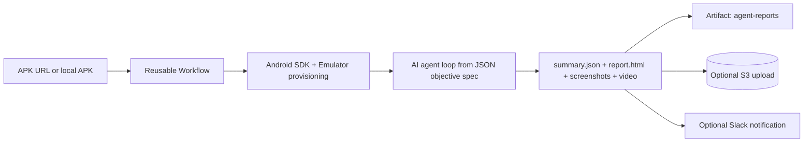

# NoSpoon AI E2E Agent Test

> Goal-based Android E2E testing powered by an AI model that can operate an emulator.

<p align="left">
  
  
  
  
</p>

## What this does

This project runs Android end-to-end tests in a different way:

- You define a test as a **goal** (plus optional hints and constraints), not as a long scripted flow.
- An AI model with computer-use capabilities (OpenAI or Claude) watches emulator screenshots and decides the next UI action.
- The framework executes those actions on Android through ADB (tap, swipe, type, key events) until success criteria are met or max steps are reached.

In short: this enables **non-programmatic, objective-driven testing** where the agent navigates the app like a human tester.

## TL;DR

1. Provide an APK URL (`https://...` or `s3://...`).
2. Trigger the reusable workflow or call it through REST API.
3. Read `summary`, download `agent-reports`, and optionally publish to S3/Slack.

---

## How it works



---

## Use the action (reusable workflow)

Reusable workflow:

- `NoSpoonLab/nospoon-ai-e2e-agent-test/.github/workflows/reusable-agent-test.yml@master`

Minimal caller example from another repository:

```yaml
name: E2E Agent Caller

on:
  workflow_dispatch:
    inputs:
      apk_url:
        required: true
        type: string

jobs:
  prepare:
    runs-on: ubuntu-latest
    outputs:
      test_spec_b64: ${{ steps.encode.outputs.spec }}
    steps:
      - uses: actions/checkout@v4
      - name: Encode test spec
        id: encode
        run: echo "spec=$(base64 -w0 < test/app_demo_test.json)" >> $GITHUB_OUTPUT

  e2e:
    needs: prepare
    uses: NoSpoonLab/nospoon-ai-e2e-agent-test/.github/workflows/reusable-agent-test.yml@master
    with:
      apk_url: ${{ inputs.apk_url }}
      test_spec_b64: ${{ needs.prepare.outputs.test_spec_b64 }}
      llm_provider: openai
      max_steps: 75
      report_s3_bucket: my-report-bucket
      report_s3_region: eu-west-1
      report_s3_path: "mobile/e2e/latest"
      app_version: "1.2.3"
      slack_webhook_url: ${{ secrets.SLACK_WEBHOOK_URL }}
      slack_message: "Nightly build validation"
    secrets:
      OPENAI_API_KEY: ${{ secrets.OPENAI_API_KEY }}
      ANTHROPIC_API_KEY: ${{ secrets.ANTHROPIC_API_KEY }}
      AWS_ACCESS_KEY_ID: ${{ secrets.AWS_ACCESS_KEY_ID }}
      AWS_SECRET_ACCESS_KEY: ${{ secrets.AWS_SECRET_ACCESS_KEY }}
      AWS_REGION: ${{ secrets.AWS_REGION }}

  results:
    needs: e2e
    runs-on: ubuntu-latest
    if: always()
    steps:
      - name: Print outputs
        run: |
          echo "result=${{ needs.e2e.outputs.result }}"
          echo "ok=${{ needs.e2e.outputs.ok }}"
          echo 'summary<<EOF'
          echo '${{ needs.e2e.outputs.summary }}'
          echo 'EOF'
```

### Available inputs (`workflow_call`)

| Input | Type | Default | Notes |
|---|---|---|---|
| `apk_url` | string | `""` | APK URL (`https://` or `s3://`) |
| `test_file` | string | `test/kokoro_agent_prod_login.json` | JSON spec path in the agent repo |
| `test_spec_b64` | string | `""` | If provided, overrides `test_file` |
| `llm_provider` | string | `openai` | `openai` or `claude` |
| `max_steps` | number | `250` | Max agent turns per substep |
| `report_s3_bucket` | string | `""` | S3 bucket for report upload |
| `report_s3_region` | string | `""` | S3 bucket region |
| `report_s3_path` | string | `""` | S3 key prefix |
| `app_version` | string | `""` | Version used in notifications |
| `slack_webhook_url` | string | `""` | Slack incoming webhook |
| `slack_message` | string | `""` | Optional Slack prefix message |

### Workflow outputs

| Output | Type | Description |
|---|---|---|
| `result` | string | `passed` or `failed` |
| `ok` | string | `true` or `false` |
| `summary` | json-string | Full run summary |

### Required secrets

- `OPENAI_API_KEY` (when `llm_provider: openai`)
- `ANTHROPIC_API_KEY` (when `llm_provider: claude`)
- `AWS_ACCESS_KEY_ID`, `AWS_SECRET_ACCESS_KEY`, `AWS_REGION` (when using `s3://` APK or S3 report upload)

---

## Trigger from REST API

You can trigger the pipeline in two ways.

Recommended auth:

- `GITHUB_TOKEN` with permission to trigger workflows/events in the target repo.
- For classic PAT, typically `repo` + `workflow`.

### Option A: `workflow_dispatch` (Actions API)

Endpoint:

- `POST /repos/{owner}/{repo}/actions/workflows/android-agent-dispatch.yml/dispatches`

Example:

```bash
curl -L -X POST \
  -H "Accept: application/vnd.github+json" \
  -H "Authorization: Bearer $GITHUB_TOKEN" \
  -H "X-GitHub-Api-Version: 2022-11-28" \
  https://api.github.com/repos/NoSpoonLab/nospoon-ai-e2e-agent-test/actions/workflows/android-agent-dispatch.yml/dispatches \
  -d '{
    "ref": "master",
    "inputs": {
      "apk_url": "https://example.com/my-app.apk",
      "test_file": "test/app_demo_test.json",
      "test_spec_b64": "",
      "llm_provider": "openai"
    }
  }'
```

Expected response: `204 No Content`.

### Option B: `repository_dispatch` (custom event)

Endpoint:

- `POST /repos/{owner}/{repo}/dispatches`

Example:

```bash
curl -L -X POST \
  -H "Accept: application/vnd.github+json" \
  -H "Authorization: Bearer $GITHUB_TOKEN" \
  -H "X-GitHub-Api-Version: 2022-11-28" \
  https://api.github.com/repos/NoSpoonLab/nospoon-ai-e2e-agent-test/dispatches \
  -d '{
    "event_type": "ucb-build-complete",
    "client_payload": {
      "apk_url": "s3://my-bucket/builds/app.apk",
      "test_spec_b64": "BASE64_JSON_OPTIONAL"
    }
  }'
```

Notes:

- `event_type` must be `ucb-build-complete` to trigger `android-agent-dispatch.yml`.
- In the current workflow, `llm_provider` from `repository_dispatch.client_payload` is not consumed; default is `openai`.

### Build `test_spec_b64`

Linux/macOS:

```bash
base64 -w0 test/app_demo_test.json
```

PowerShell:

```powershell
$raw = Get-Content .\test\app_demo_test.json -Raw
[Convert]::ToBase64String([Text.Encoding]::UTF8.GetBytes($raw))
```

---

## Check run status via API

List recent workflow runs:

```bash
curl -L \
  -H "Accept: application/vnd.github+json" \
  -H "Authorization: Bearer $GITHUB_TOKEN" \
  -H "X-GitHub-Api-Version: 2022-11-28" \
  "https://api.github.com/repos/NoSpoonLab/nospoon-ai-e2e-agent-test/actions/runs?per_page=10"
```

Get one run:

```bash
curl -L \
  -H "Accept: application/vnd.github+json" \
  -H "Authorization: Bearer $GITHUB_TOKEN" \
  -H "X-GitHub-Api-Version: 2022-11-28" \
  "https://api.github.com/repos/NoSpoonLab/nospoon-ai-e2e-agent-test/actions/runs/<RUN_ID>"
```

List artifacts (includes `agent-reports`):

```bash
curl -L \
  -H "Accept: application/vnd.github+json" \
  -H "Authorization: Bearer $GITHUB_TOKEN" \
  -H "X-GitHub-Api-Version: 2022-11-28" \
  "https://api.github.com/repos/NoSpoonLab/nospoon-ai-e2e-agent-test/actions/runs/<RUN_ID>/artifacts"
```

---

## Objective spec (non-programmatic test definition)

A minimal JSON spec focuses on **what must be achieved**, not how to click through every step:

```json
{
  "apk": "apk/app-under-test.apk",
  "package": "com.example.app",
  "activity": ".MainActivity",
  "goal": "Reach the home screen",
  "suggestions": "If asked for email, use test_{timestamp}@example.com",
  "negative_prompt": "Do not open external links",
  "success_criteria": "Home screen is fully visible"
}
```

This lets the AI agent adapt to UI changes while still following clear constraints.

---

## Practical recommendations

- Prefer sending `test_spec_b64` in API-triggered runs to avoid path mismatches.
- If your APK URL is `s3://...`, configure AWS secrets in the calling repository.
- Use `ok == true` or `result == passed` as pipeline quality gates.
